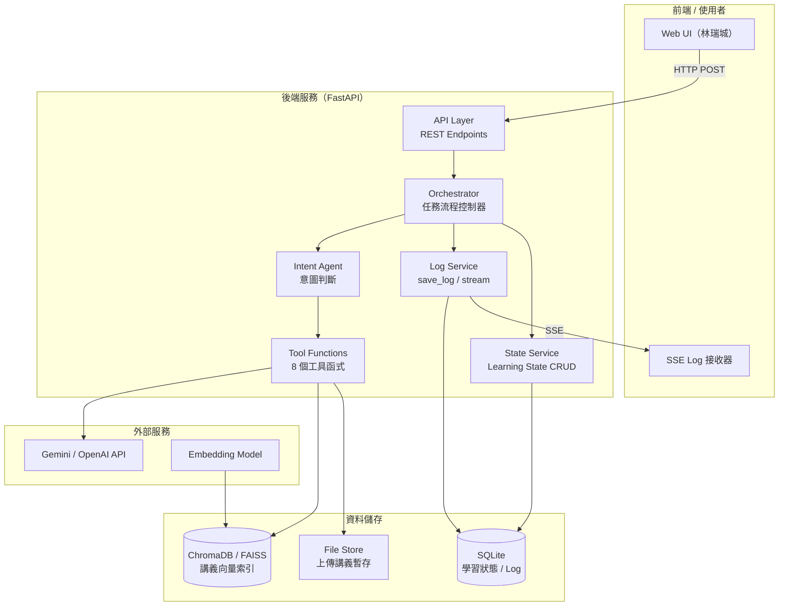
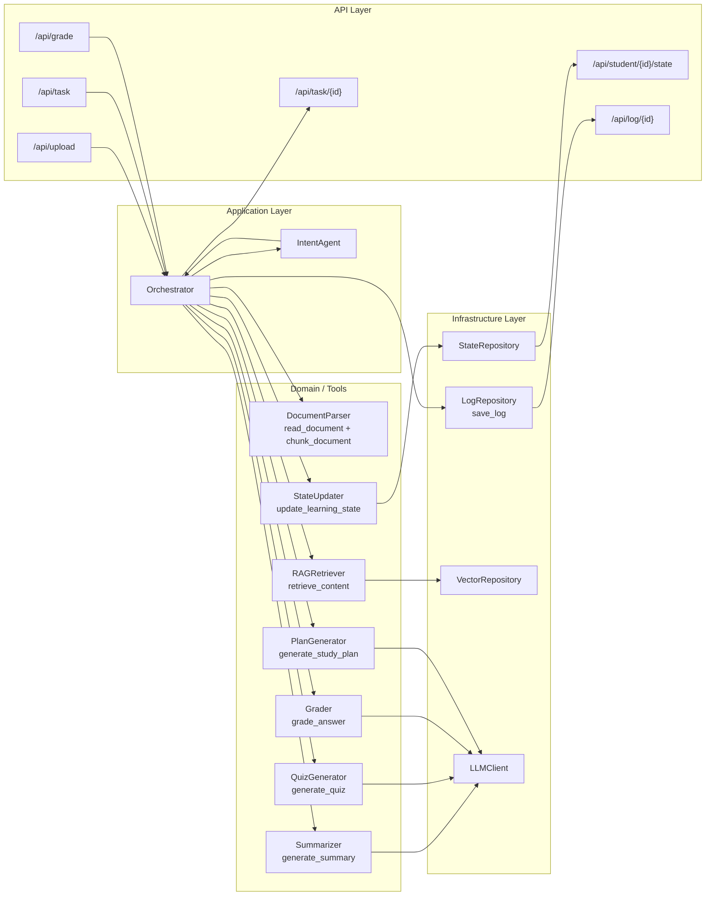
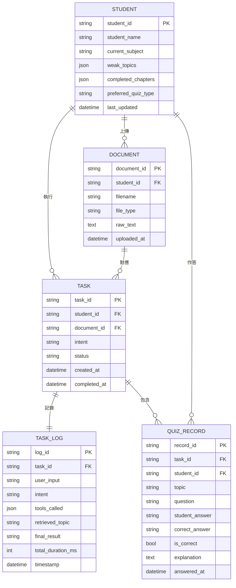
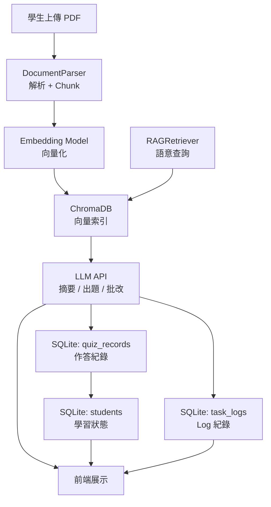
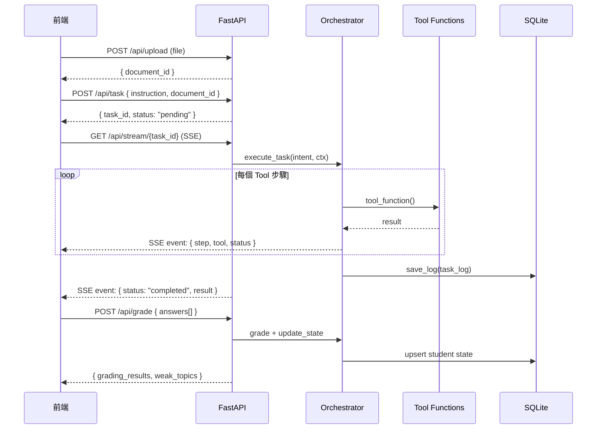
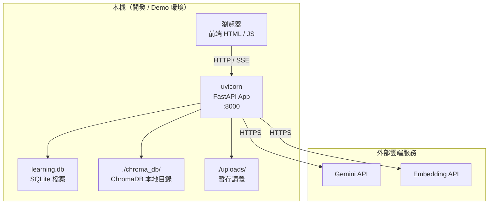

# 系統架構設計文件（Architecture Design Document）
## AI 課堂講義學習與複習規劃 Agent — 後端 / 系統整合模組

---

## 1. 文件基本資訊（Document Metadata）

| 欄位 | 內容 |
|------|------|
| **文件標題** | AI 課堂講義學習與複習規劃 Agent — 後端 / 系統整合 ADD |
| **版本號** | v1.0 |
| **負責人** | 黃柏豪（後端 / 系統整合） |
| **建立日期** | 2026-05-20 |
| **更新日期** | 2026-05-20 |
| **審核人員** | 組長、林瑞城（前端）、沈靖恩（Agent）、楊沁霖（RAG） |
| **關聯文件** | [docs/prd.md](./prd.md) |

---

## 2. 架構概覽（Architecture Overview）

### 2.1 系統簡介

本系統是一個以 **FastAPI** 為核心的後端服務，支援 AI Agent 協作執行學習任務。學生上傳講義（PDF / PPT）後，系統透過多層 Agent 完成重點摘要、測驗生成、批改、弱點分析與複習規劃，並將所有執行歷程持久化儲存，以供前端即時呈現與事後查閱。

### 2.2 架構風格

採用 **分層架構（Layered Architecture）+ 事件驅動工具呼叫（Tool-Calling Agent Pattern）** 的混合設計：

- **表現層（API Layer）**：FastAPI 路由，處理 HTTP 請求與 SSE 推送
- **應用層（Application Layer）**：Intent 判斷、任務流程控制器（Orchestrator）
- **領域層（Domain Layer）**：各 Tool Function 業務邏輯（摘要、出題、批改…）
- **基礎設施層（Infrastructure Layer）**：SQLite、ChromaDB / FAISS、LLM API 呼叫

### 2.3 高階架構圖



---

## 3. 技術選型（Technology Stack）

| 層次 | 技術選擇 | 選擇理由 |
|------|---------|---------|
| **後端框架** | FastAPI（Python 3.11+） | 原生支援 async/await、自動生成 OpenAPI 文件、SSE 支援佳、團隊熟悉 Python |
| **關聯式資料庫** | SQLite | 無需額外部署、適合單機 Demo 環境、Python 內建 sqlite3 支援 |
| **向量資料庫** | ChromaDB（預設）/ FAISS（備選） | ChromaDB 支援本地持久化且 API 友善；FAISS 效能更高但較底層 |
| **LLM** | Gemini API（主）/ OpenAI API（備） | Gemini 支援中文表現佳、已有 API Key；OpenAI 為業界標準備援 |
| **Embedding** | text-embedding-004（Google）或 text-embedding-3-small（OpenAI） | 支援中文語意、向量維度適中（768/1536） |
| **文件解析** | pdfplumber（PDF）/ python-pptx（PPT） | 中文 PDF 提取穩定；python-pptx 為 PPT 標準解析庫 |
| **即時通訊** | Server-Sent Events（SSE） | 單向推播足夠、比 WebSocket 輕量、FastAPI 原生支援 |
| **ORM / DB 工具** | SQLAlchemy（Core 模式）或 aiosqlite | 支援 async 操作、不過度抽象 |
| **部署** | 本機 uvicorn（開發 / Demo） | 輕量、啟動快、適合期末 Demo 場景 |

---

## 4. 系統元件設計（Component Design）

### 4.1 元件關係圖



### 4.2 各元件說明

| 元件 | 職責 | 對外介面 | 依賴 |
|------|------|---------|------|
| **API Layer** | HTTP 路由、請求驗證、回應序列化 | REST Endpoints、SSE Stream | Orchestrator |
| **IntentAgent** | 解析自然語言指令，判斷任務類型（Summary / Quiz / Plan / Full） | `classify(text) -> IntentType` | LLMClient（可選，也可用關鍵字規則） |
| **Orchestrator** | 根據 Intent 決定執行哪些 Tool，管理步驟順序與錯誤處理 | `execute_task(intent, ctx) -> TaskResult` | 所有 Tool Functions |
| **DocumentParser** | 解析 PDF / PPT 為純文字，切分 Chunk | `parse(file) -> chunks[]` | pdfplumber, python-pptx |
| **RAGRetriever** | 接收查詢，從向量庫檢索相關段落（TF-IDF + 語意搜尋混合） | `retrieve(query) -> paragraphs[]` | VectorRepository |
| **Summarizer** | 呼叫 LLM 生成段落摘要 | `summarize(chunks[]) -> summary` | LLMClient |
| **QuizGenerator** | 根據主題呼叫 LLM 生成選擇題 | `generate(topic, n) -> questions[]` | LLMClient |
| **Grader** | 批改學生答案，提供解析 | `grade(q, answer) -> result` | LLMClient |
| **StateUpdater** | 更新學習狀態 Memory（弱點計數、章節完成） | `update(student_id, quiz_results)` | StateRepository |
| **PlanGenerator** | 根據弱點與考試日期生成複習計畫 | `plan(weak_topics, exam_date) -> plan` | LLMClient |
| **LogRepository** | 持久化 TaskLog 至 SQLite，提供 SSE 推播 | `save(log)`, `stream(task_id)` | SQLite, SSE |
| **StateRepository** | 學習狀態 CRUD | `get(student_id)`, `upsert(state)` | SQLite |
| **VectorRepository** | 管理向量索引（建立、查詢） | `index(chunks[])`, `search(query)` | ChromaDB / FAISS |
| **LLMClient** | 封裝 LLM API 呼叫，統一介面、處理重試 | `complete(prompt) -> text` | Gemini / OpenAI API |

---

## 5. 資料架構（Data Architecture）

### 5.1 ER 圖



### 5.2 資料儲存策略

| 資料類型 | 儲存位置 | 保留期限 | 說明 |
|---------|---------|---------|------|
| 學生學習狀態 | SQLite `students` | 永久 | 跨 Session 保留弱點記憶 |
| 任務 Log | SQLite `task_logs` | 30 天 | 完整工具呼叫鏈紀錄 |
| 測驗作答紀錄 | SQLite `quiz_records` | 永久 | 用於弱點分析 |
| 講義向量索引 | ChromaDB | Per Session | 每次上傳重建，可選持久化 |
| 上傳原始檔案 | 本機 FileStore（`/tmp/uploads`） | Session 結束後清除 | 不長期儲存原始講義 |

### 5.3 資料流向



---

## 6. API 設計（API Design）

### 6.1 統一回應格式

所有 API 統一回傳以下結構：

```json
{
  "status": "success | error",
  "data": { ... },
  "error": {
    "code": "ERROR_CODE",
    "message": "錯誤說明"
  }
}
```

### 6.2 端點規格

| 方法 | 路徑 | 描述 | 請求格式 | 回應格式 |
|------|------|------|---------|---------|
| `POST` | `/api/upload` | 上傳講義檔案 | `multipart/form-data: file, student_id` | `{ data: { document_id } }` |
| `POST` | `/api/task` | 送出任務請求 | `{ student_id, document_id, instruction }` | `{ data: { task_id, status: "pending" } }` |
| `GET` | `/api/task/{task_id}` | 查詢任務狀態與結果 | — | `{ data: { status, result, steps_done } }` |
| `GET` | `/api/student/{student_id}/state` | 查詢學習狀態 | — | `{ data: { weak_topics, completed_chapters, ... } }` |
| `POST` | `/api/grade` | 提交作答結果 | `{ task_id, student_id, answers[] }` | `{ data: { grading_results[], weak_topics } }` |
| `GET` | `/api/log/{task_id}` | 取得任務 Log | — | `{ data: { log_id, tools_called[], ... } }` |
| `GET` | `/api/stream/{task_id}` | SSE 即時 Log 推播 | — | `text/event-stream` |

### 6.3 API 呼叫序列圖



### 6.4 版本控制策略

- 使用 URL 路徑版本號：`/api/v1/...`（v1.0 暫時省略，正式部署時補上）
- 版本升級時保留舊版至少一個版本週期

---

## 7. 安全性設計（Security Design）

| 面向 | 設計決策 |
|------|---------|
| **身份驗證** | v1.0 使用 `student_id`（UUID）作為識別，由前端首次訪問時生成並持久化至 LocalStorage；不實作完整 OAuth |
| **CORS** | FastAPI 設定 `CORSMiddleware`，明確允許前端 origin，禁止 wildcard（`*`） |
| **檔案上傳防護** | 限制 MIME Type（僅允許 `application/pdf`, `application/vnd.openxmlformats-officedocument.presentationml.presentation`）；檔案大小 ≤ 50MB |
| **Input Validation** | 所有請求參數透過 Pydantic Model 驗證，自動過濾非法輸入 |
| **Rate Limiting** | 對 `/api/task` 設定 IP 速率限制（每分鐘 ≤ 10 次），防止 LLM API 濫用 |
| **敏感資料** | LLM API Key 存於環境變數（`.env`），不寫入程式碼或版本控制 |

---

## 8. 部署架構（Deployment Architecture）

### 8.1 環境規劃

| 環境 | 說明 |
|------|------|
| **Development** | 本機 `uvicorn --reload`，SQLite 本地檔，ChromaDB 本地持久化 |
| **Demo（期末）** | 同 Development 環境，確保 Demo 流程穩定可重現 |
| **Production（Out of Scope）** | Docker 容器化部署，超出本版本範圍 |

### 8.2 本機部署架構圖



### 8.3 目錄結構

```
backend/
├── main.py                  # FastAPI app 入口
├── routers/
│   ├── upload.py            # /api/upload
│   ├── task.py              # /api/task, /api/task/{id}
│   ├── grade.py             # /api/grade
│   ├── student.py           # /api/student/{id}/state
│   └── log.py               # /api/log/{id}, /api/stream/{id}
├── services/
│   ├── orchestrator.py      # 任務流程控制器
│   ├── intent_agent.py      # Intent 判斷
│   └── log_service.py       # Log 管理與 SSE 推播
├── tools/
│   ├── document_parser.py   # read_document, chunk_document
│   ├── rag_retriever.py     # retrieve_content
│   ├── summarizer.py        # generate_summary
│   ├── quiz_generator.py    # generate_quiz
│   ├── grader.py            # grade_answer
│   ├── state_updater.py     # update_learning_state
│   └── plan_generator.py    # generate_study_plan
├── repositories/
│   ├── state_repo.py        # StudentState CRUD
│   ├── log_repo.py          # TaskLog CRUD
│   └── vector_repo.py       # ChromaDB 操作
├── models/
│   ├── schemas.py           # Pydantic 請求 / 回應 Schema
│   └── db_models.py         # SQLAlchemy Table 定義
├── core/
│   ├── llm_client.py        # LLM API 封裝
│   └── config.py            # 環境變數載入
├── learning.db              # SQLite 資料庫（gitignore）
├── chroma_db/               # ChromaDB 向量索引（gitignore）
└── .env                     # API Keys（gitignore）
```

---

## 9. 非功能性考量（Non-Functional Considerations）

| 面向 | 設計決策 |
|------|---------|
| **效能** | 非 LLM 端點 < 200ms（P95）；LLM 任務非同步執行；向量查詢 Top-K 設為 3-5 篇，避免 Context 過長 |
| **可靠性** | LLM 呼叫加入最多 3 次指數退避重試；Tool 失敗時 Orchestrator 捕獲例外，回傳 `status: failed` 並記錄 Log |
| **可觀測性** | 每個 Tool 呼叫記錄執行時間（`duration_ms`）至 TaskLog；FastAPI 內建 `/docs` Swagger UI；結構化 JSON Log 輸出至 stdout |
| **可維護性** | Tool Functions 遵守單一職責原則，可獨立測試；LLMClient 封裝所有 LLM 差異，切換供應商只需改 Client |
| **可測試性** | LLMClient 設計為可 Mock；Repository 層可用 in-memory SQLite 替換；Tool Function 接受純 Python 物件輸入，便於單元測試 |

---

## 10. 架構決策紀錄（Architecture Decision Records）

### ADR-001：選擇 SQLite 作為主要資料庫

- **背景**：需要持久化學習狀態與 Log，但系統為 Demo 規模，不預期高並發。
- **決策**：使用 SQLite（`aiosqlite` 支援 async）。
- **理由**：無需額外部署、Python 內建支援、適合單機 Demo；後續若需擴展可遷移至 PostgreSQL。
- **後果**：並發寫入能力受限（SQLite 鎖定機制），但 Demo 場景下單用戶操作，影響可忽略。

---

### ADR-002：Log 即時推播採用 SSE 而非 WebSocket

- **背景**：前端需要即時看到 Agent 每個步驟的執行狀態。
- **決策**：使用 Server-Sent Events（SSE）。
- **理由**：SSE 為單向推播，符合「後端主動推送 Log 事件」的場景；比 WebSocket 輕量，FastAPI 透過 `StreamingResponse` 原生支援，無需額外套件。
- **後果**：若未來需要雙向即時通訊（如學生即時互動），需升級至 WebSocket。

---

### ADR-003：向量資料庫預設 ChromaDB，保留 FAISS 切換彈性

- **背景**：RAG 模組需要向量檢索，需選擇本地可部署的向量資料庫。
- **決策**：預設使用 ChromaDB，透過 `VectorRepository` 抽象介面保留切換至 FAISS 的彈性。
- **理由**：ChromaDB 提供直覺的 Python API，支援本地持久化，適合 Demo；FAISS 效能更高但需手動管理索引。
- **後果**：`VectorRepository` 介面需維持穩定，避免上層業務邏輯直接依賴 ChromaDB 細節。

---

### ADR-004：任務非同步執行採用 FastAPI BackgroundTask

- **背景**：LLM 任務執行時間可能長達 30 秒，不可阻塞 HTTP 回應。
- **決策**：使用 `FastAPI.BackgroundTasks` 執行任務，立即回傳 `task_id`，前端透過 SSE 追蹤進度。
- **理由**：Demo 規模不需引入 Celery + Redis 等重型任務隊列；BackgroundTask 足以支撐單用戶並發需求。
- **後果**：進程重啟會中斷進行中的背景任務；正式環境應遷移至 Celery。

---

## 11. 開放問題（Open Questions）

| # | 問題 | 影響範圍 | 負責確認 |
|---|------|---------|---------|
| Q1 | LLM 確認使用 Gemini 或 OpenAI？影響 LLMClient 實作 | LLMClient、Embedding 選型 | 組長 |
| Q2 | ChromaDB 向量索引是否需要跨 Session 持久化？或每次上傳重建？ | VectorRepository 設計 | 楊沁霖 |
| Q3 | 前後端是否同 Origin？影響 CORS 設定與 SSE 連線穩定性 | API Layer、CORS 設定 | 林瑞城 / 黃柏豪 |
| Q4 | `student_id` 由前端 UUID 生成或後端 `POST /api/student` 派發？ | Student 資料建立流程 | 黃柏豪 |
| Q5 | Intent 判斷採用關鍵字規則或 LLM 分類？影響準確率與延遲 | IntentAgent 實作 | 沈靖恩 |

---

*文件版本：v1.0 ｜ 最後更新：2026-05-20 ｜ 負責人：黃柏豪（後端 / 系統整合）*
*關聯 PRD：[docs/prd.md](./prd.md)*
