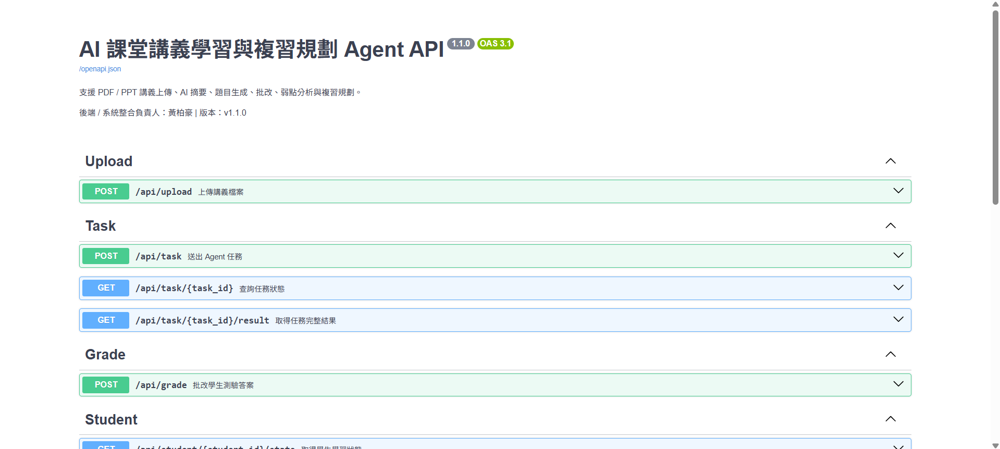

# AI 課堂講義學習與複習規劃 Agent - 後端測試流程指南

這份文件總結了我們在專案中測試後端功能與 API 流程的標準步驟。你可以依照此指南在本地環境中順利跑完「講義上傳 -> RAG 檢索 -> AI 總結與出題」的完整流程。

## 1. 環境配置與啟動

在開始測試前，必須確保模型環境正確設定。

1. **取得支援的模型**
   - 由於不同 Google 帳號的權限與額度不同，如果遇到 `404` 或 `429` 錯誤，請先執行 `test_models.py` 來確認你的 API Key 支援哪些模型。
2. **修改環境變數 (`.env`)**
   - 根據上一步的結果修改 `.env` 檔案（建議使用最新的 `gemini-2.5-flash` 和 `gemini-embedding-2`）。
   - 如果遇到嚴格的 API 配額限制，可以將 `LLM_PROVIDER` 暫時改為 `mock` 來進行展示，這樣能完全繞過 API 呼叫，直接測試後端系統流程。
3. **啟動伺服器**
   - 在 `backend` 目錄下執行：`python main.py`
   - 看到 `Application startup complete.` 即代表啟動成功。

我個人是推薦自己創一個 venv 來做測試比較好

```bash
# 建立 .venv 環境
py -3.11 -m venv .venv

# 啟用 .venv，如果當前不在 backend 目錄的話，請先 cd 到 backend 目錄
.venv\Scripts\activate

# 安裝 requirements
pip install -r requirements.txt

# 啟動後端，此時在 Terminal 會顯示 http://localhost:8000/docs
python main.py
```

此時瀏覽器會顯示 API 測試頁面



---

## 2. API 測試流程 (使用 Swagger UI)

請打開瀏覽器前往：[http://localhost:8000/docs](http://localhost:8000/docs)

測試用的學生ID: 123e4567-e89b-12d3-a456-426614174000

### Step 1: 講義上傳 (`POST /api/upload`)
- **目的**：將 PDF 講義上傳並建立 ChromaDB 的向量索引。
- **操作**：上傳一份 PDF 測試檔案，並輸入 `student_id`。
- **預期結果**：回傳 `document_id` 與成功訊息。這個 `document_id` 將用於後續的任務。

記錄下 document_id

### Step 2: 建立 Agent 任務 (`POST /api/task`)
- **目的**：根據使用者的自然語言指令，驅動 Agent 判斷意圖並執行相關任務（例如：摘要、出題、讀書計畫）。
- **操作**：
  ```json
  {
    "student_id": "你的學號",
    "document_id": "剛剛拿到的 document_id",
    "instruction": "請幫我總結這份文檔，並提出一題選擇題考我"
  }
  ```
- **預期結果**：系統會以背景任務 (BackgroundTasks) 非同步執行，並立刻回傳 HTTP 202 及一組 `task_id`。

紀錄一下 task_id

### Step 3: 即時監控進度 (`GET /api/log/{task_id}/stream`) - *[選項]*
- **目的**：前端可用來即時渲染 Agent 執行到了哪一個步驟。
- **操作**：輸入 `task_id`。
- **預期結果**：回傳 SSE (Server-Sent Events) 的事件流，例如 `[Step 1] 讀取並解析講義...`、`[Step 2] RAG 查詢相關段落...`。

### Step 4: 取得最終完整結果 (`GET /api/task/{task_id}/result`)
- **目的**：任務完成後，直接取得完整的 JSON 格式報告。
- **操作**：輸入任務完成後的 `task_id`。
- **預期結果**：會回傳結構合法、乾淨的 JSON。
  ```json
  {
    "status": "success",
    "data": {
      "summary": {
        "summary": "...",
        "key_points": ["..."]
      },
      "quiz": [
        {
          "question": "...",
          "options": ["A", "B", "C", "D"],
          "correct_answer": "...",
          "explanation": "..."
        }
      ],
      "plan": null
    }
  }
  ```

### Step 5: 批改學生成績 (`POST /api/grade`)
- **目的**：對學生的作答進行批改，更新弱點記憶並回傳詳細解析。
- **特點 (已重構)**：為了確保安全性與資料一致性，**前端不需要傳送 `correct_answer`**，後端會自動從資料庫（`generated_quizzes`）比對 Agent 出題時的正確答案。
- **操作**：
  請求體 JSON 範例：
  ```json
  {
    "task_id": "你的 task_id",
    "student_id": "你的學號",
    "answers": [
      {
        "quiz_index": 0,
        "student_answer": "逆文件頻率"
      },
      {
        "quiz_index": 1,
        "student_answer": "詞向量"
      }
    ]
  }
  ```
- **預期結果**：回傳批改結果、正確率、弱點更新計數，以及個人化的複習建議。

---

## 3. 常見問題與除錯 (Troubleshooting)

1. **生成出來的 Quiz 欄位是 `null`？**
   - **原因**：Agent 的 `IntentAgent` 意圖分類器會根據指令的「關鍵字」決定要執行哪些步驟。如果你只寫了「幫我總結」，它就只會執行 summary 流程。
   - **解法**：請確保指令足夠明確，例如：「總結這份文檔，**並出題考我**」。
2. **回傳 JSON 解析失敗 (SyntaxError 或 fallback 為字串)**
   - **原因**：過去的 LLM 有時會用 Markdown (` ```json `) 包裝結果，或是長度截斷。
   - **解法**：我們已經在 `core/llm_client.py` 加上了 `is_json=True`（對應 Gemini 的 `response_mime_type="application/json"`）強制規範，這個問題已經完美解決。
3. **RAG 檢索回傳 0/0 段落**
   - **原因**：更換 Embedding 模型後，向量維度不同，舊的 ChromaDB 集合可能失效或重建。
   - **解法**：務必重新執行 `POST /api/upload` 上傳講義取得新的 `document_id`。