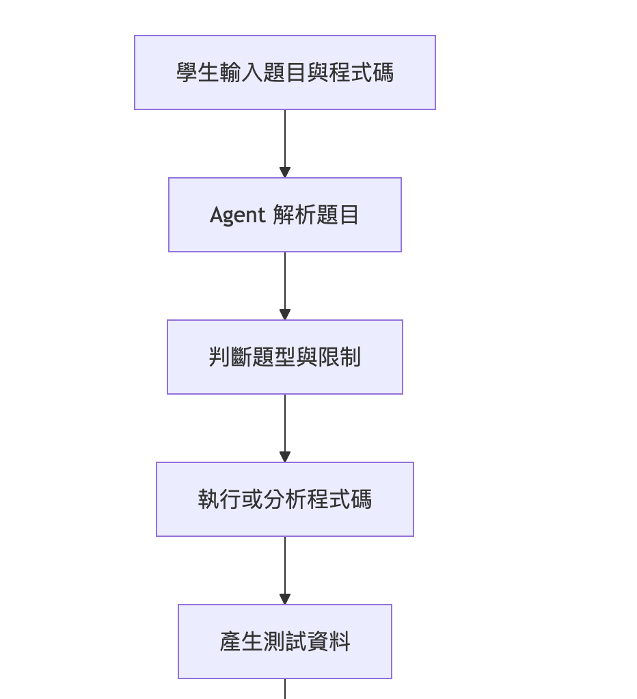

# 📚 StudyAgent AI — 課堂講義學習與複習規劃系統
### 期末專題簡報

---

## 1. 👥 組員

| 姓名 | 學號 | 負責角色 |
|:---|:---|:---|
| 林瑞城 | （學號） | 前端 / UI 設計 |
| 黃柏豪 | D1249756 | 後端 / 系統整合 |
| 沈靖恩 | D1321025 | Agent / 核心邏輯 |
| 楊姍頤 | （學號） | RAG / 資料處理 |

---

## 2. 💡 為什麼想做這個系統？

### 我們觀察到的問題

大學生在期中、期末備考時，普遍面對以下困境：

1. **講義篇幅龐大，重點分散**
   課堂 PPT 往往有數十甚至上百頁，充斥圖表與破碎文字，難以在短時間內提取核心觀念。

2. **缺乏客觀評估，不知道自己哪裡不會**
   只看講義容易產生「我已經懂了」的錯覺，缺少即時且客觀的自我測驗機制。

3. **無效複習，時間分配不均**
   學生不清楚自己卡在哪個具體知識點（例如「梯度下降」懂了，但「L2 正規化」算錯），導致平均分配時間，複習效率低落。

4. **市面工具無法適應個人差異**
   一般學習網站只能提供固定題目，無法根據學生歷史答題錯誤，動態調整推薦主題與時程。

### 為什麼需要 AI Agent？

一般靜態網站無法「理解」講義語意，也無法執行複雜的分步任務。我們的系統需要 AI Agent 來：

- **動態任務編排**：自動指派摘要、出題、批改等完整流程任務
- **RAG 知識檢索**：從講義原文中召回最相關段落，避免 AI 憑空捏造
- **弱點記憶更新**：將每次答題結果加權記錄，形成個人化「弱點記憶庫」，下次出題時自動調高弱點主題的權重

---

## 3. ⚙️ 系統功能

### 核心功能一覽

| 功能 | 說明 |
|:---|:---|
| 📤 **講義上傳解析** | 支援 PDF、PPTX、TXT、Markdown 格式上傳，自動萃取文字並建立向量索引 |
| 🧠 **AI 智慧摘要** | 自動濃縮講義核心重點，以結構化卡片呈現，並附帶頁碼來源標註 |
| 💡 **核心詞彙閃卡** | 自動提取專有名詞，製成可翻面的詞彙閃卡（正面術語、背面定義） |
| ✍️ **智能出題測驗** | 根據講義內容與個人弱點，動態生成選擇題、是非題、複選題 |
| 📊 **即時批改解析** | 提交答案後立即批改，並附上 AI 詳細解析說明 |
| 🗺️ **個人化複習計畫** | 依據弱點主題與考試時間，生成動態調整的複習時程規劃 |
| 💬 **講義 AI 隨身問答** | 可針對已上傳講義的任何內容提問，使用 RAG 技術進行語意檢索後回答 |
| 📂 **學習歷程紀錄** | 記錄歷史上傳講義、答題對錯紀錄，登入後跨裝置保存 |

### 技術架構

```
前端：HTML + CSS + JavaScript（單頁 SPA）
後端：FastAPI（Python）
AI：Google Gemini 2.5 Flash
向量資料庫：ChromaDB（本地持久化）
關聯資料庫：SQLite
部署方式：前後端同機，FastAPI StaticFiles 服務前端
```

### 專案資料夾架構

```text
114-Group_One_Final-1/
├── backend/                   # 系統後端與 AI 核心
│   ├── main.py                # 系統進入點 (FastAPI App)
│   ├── core/                  # 核心設定檔與 LLM Client
│   ├── services/              # Orchestrator 與意圖判斷
│   │
│   ├── tools/                 # AI Agents 與工具模組
│   │   ├── document_parser.py # 處理上傳講義
│   │   ├── rag_retriever.py   # 負責語意搜尋
│   │   ├── summarizer.py      # 負責產生摘要
│   │   ├── quiz_generator.py  # 負責產生測驗
│   │   ├── grader.py          # 負責批改
│   │   └── plan_generator.py  # 負責產生複習計畫
│   │
│   ├── repositories/          # 狀態與資料管理
│   │   ├── state_repo.py      # 管理學生 SQLite 弱點與進度
│   │   └── vector_repo.py     # 管理 RAG 向量資料
│   │
│   ├── chroma_db/             # 向量知識庫 (持久化儲存)
│   ├── uploads/               # 存放使用者上傳的講義檔案
│   │
│   ├── routers/               # API 路由 (前後端溝通橋樑)
│   └── frontend/              # 網站前端 UI 介面
│       ├── index.html
│       ├── style.css
│       └── app.js
│
├── D1249756_docs/             # 開發文件與截圖區
│   ├── prd.md                 # 產品需求文件
│   └── architecture.md        # 系統架構文件
│
├── prompts/                   # 集中管理各 Agent 的 System Prompt
├── 期末專題主題提案報告說明.md    
└── 期末簡報.md                  
```

### Agent 工作流程




---

## 4. 🎬 實際 Demo 展示

### Demo 流程

1. **登入系統** — 展示會員登入介面與個人學習歷程 Dashboard
2. **上傳講義** — 上傳「機器學習與深度學習基礎」PDF 講義
3. **啟動 AI 分析** — 觀看 Agent 工作流程 Terminal 即時輸出（5 個步驟動態展示）
4. **查看重點摘要** — 結構化摘要卡片、詞彙閃卡（點擊翻牌）
5. **進行測驗** — 作答 AI 生成的題目，提交後看批改解析
6. **查看複習計畫** — 依弱點主題生成的個人化複習時程
7. **AI 隨身問答** — 直接對講義提問，展示 RAG 語意檢索效果

### 系統截圖 / 影片

> 📌 *（請在此補充 Demo 影片連結或截圖）*

---

## 5. 📋 分工表

| 成員 | 角色 | 具體負責內容 |
|:---|:---|:---|
| **林瑞城** | 前端 / UI 設計 | • 使用者介面設計（上傳頁 / Dashboard）<br>• 使用流程設計（UX）<br>• Agent 流程動畫展示（Step-by-step Terminal）<br>• 測驗頁面與結果呈現 |
| **黃柏豪** | 後端 / 系統整合 | • API 設計與串接（前後端溝通）<br>• 使用者資料管理（學習紀錄 SQLite）<br>• 系統流程控制（任務觸發）<br>• Log 紀錄與儲存 |
| **沈靖恩** | Agent / 核心邏輯 | • Agent 任務流程設計（Intent 意圖判斷）<br>• Prompt 設計（摘要 / 出題 / 批改）<br>• Tool Calling 邏輯實作<br>• Memory / State 弱點管理 |
| **楊姍頤** | RAG / 資料處理 | • 講義解析（PDF / PPT → 文字萃取）<br>• Chunking 與向量化（Embedding）<br>• ChromaDB 向量資料庫建置<br>• `retrieve_content()` 語意檢索實作 |

---

## 6. 🔗 專題 GitHub 網址

> 📌 *（請補上 GitHub 網址）*

```
https://github.com/Shanyii/114-Group_One_Final
```

---

*© 2026 StudyAgent AI — 第一組 期末專題*
